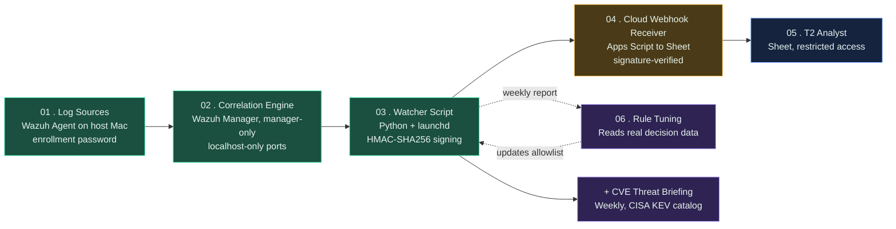

# Zero-Cost Automated SOC Escalation Pipeline

A fully automated, $0-cost, lightweight security operations pipeline that replaces manual Tier-1 SOC analyst triage with rule-based automation — running on a single 8GB RAM Intel Mac. Tested end-to-end against real, MITRE ATT&CK-mapped attack techniques, not just designed on paper.

**Live interactive architecture diagram:** [er723.github.io/soc-pipeline](https://er723.github.io/soc-pipeline/)

**This is the public documentation repo** — architecture write-up, test methodology, evidence, and honest limitations documentation. **The full implementation source (scripts, configs, deployment automation) lives in a private companion repository — reach out if you'd like access for review.**

## Architecture

## Verified test results

Three real, MITRE ATT&CK-mapped techniques were tested against the live pipeline and confirmed landing end-to-end in Discord and Google Sheets, with HMAC-signature-verified delivery:

| Technique | MITRE ID | Result |
|---|---|---|
| Sudo brute-force | T1110 | Escalated correctly |
| Rootcheck / rootkit indicator | T1014 | Escalated correctly |
| New listening port / backdoor indicator | T1571 | Escalated correctly |
| LaunchAgent persistence (official Atomic Red Team artifact) | T1543.001 | Decision logic proven separately; FIM new-file detection not achieved — documented gap |

**Full test methodology and evidence:** [`docs/portfolio-test-results.md`](docs/portfolio-test-results.md)
**What this pipeline can and can't detect:** [`docs/technique-coverage.md`](docs/technique-coverage.md)
**Operational drawbacks and limitations:** [`docs/known-limitations.md`](docs/known-limitations.md)

## What this does

1. **Wazuh Agent** collects host telemetry (file integrity, log collection, rootcheck, SCA benchmarks)
2. **Wazuh Manager** (Docker, manager-only mode) correlates events and scores severity
3. **Watcher script** dedupes repeat alerts, auto-closes known-benign patterns, escalates anything above threshold
4. **Cloud webhook** (Google Apps Script, HMAC-signature verified) logs escalations to a restricted Sheet and notifies Discord
5. **Weekly rule-tuning report** analyzes real decision history and recommends threshold/allowlist adjustments
6. **Weekly CVE briefing** pulls CISA's Known Exploited Vulnerabilities catalog

## Resource footprint

| Component | Footprint |
|---|---|
| Wazuh Manager (Docker) | ~475MB-1.5GB RAM |
| Watcher script | <100MB RAM |
| Weekly automation scripts | negligible |
| Total disk (post-cleanup) | ~200MB |

## Security hardening

- Manager ports bound to `127.0.0.1` only
- All watcher-to-webhook requests signed with HMAC-SHA256; receiver rejects invalid requests, logging attempts to a Debug audit tab
- Agent enrollment requires a pre-shared password
- Google Sheet restricted to named accounts, no link-sharing
- Discord webhook rotated after incidental exposure during development
